# UV Snapshot Exporter
## version 0.1

This tool is used to export the uvSnapshots of all the uvSets of all selected meshes

## Installation

* Put the UVSnapshotExporter folder in a maya script directory (I.e: C:\Users\user\Documents\maya\scripts on Windows)    
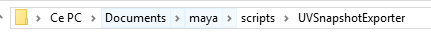

* The content of the folder need to be this one  
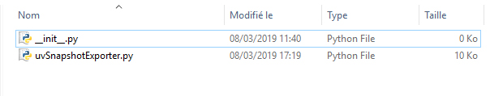  
 
* Create a shelf button in Maya with the following Python command  
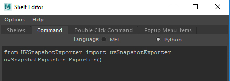  

## How to use
1 - Open a scene

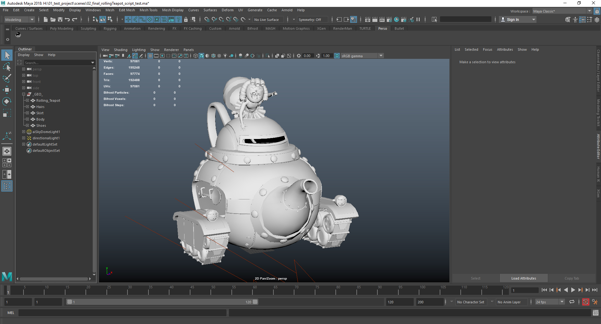  

2 - Click on the shelf button to launch the tool  

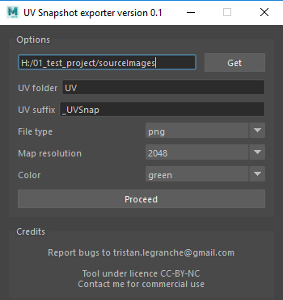  

3 - Select objects  

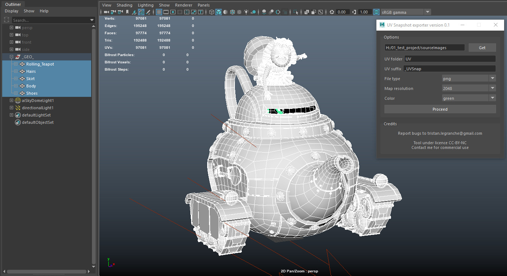

4 - Define the parameters

5 - Click on proceed  

  

6 - Enjoy !  

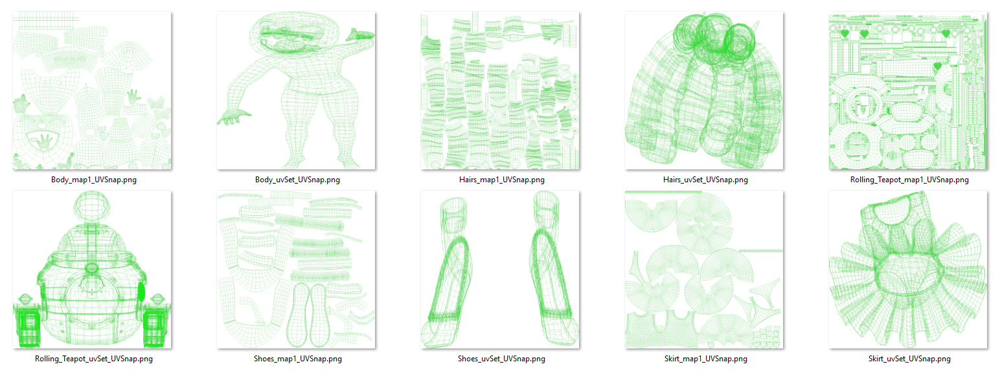  

## Features details

* #### Options
Use the **Get** button to set the folder where the snapshots will be created (default: project/sourceImages)

Use UV Folder to create a subdirectory in the specified path (leave empty if you don't need a subdirectory)

Use UV suffix to add a suffix to the maps name (don't forget to add a '_' or a '-'... otherwise the name will be stacked)

Use File type to specify the extension of the snapshots

Use Map resolution to specify the resolution of the snapshots

Use Color to specify the color of the UVs in the snapshots

* #### Proceed

This button launch the snapshot export

## Limitations

1. Only work on selected objects, the script doesn't look in the hierarchy
2. Can be a bit slow if you export a lot of UVs at once

## Step by step on a case
1 - A scene is opened  

    
2 - The objects have multiple uvSets  

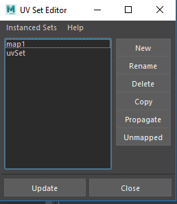  

3 - Like this one  

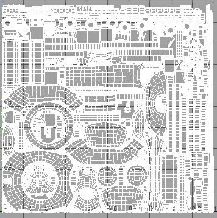  

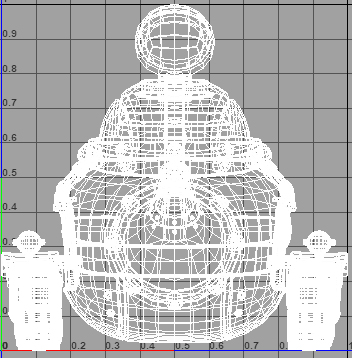  

4 - I select the objects to export their UVSnapshots  

    

5 - I launch the script and set the options to export in project/sourceImages, create a new UV folder in it, have a _UVSnap prefix and make 2048x2048 png files with green UVs  

  

6 - I click on proceed  

  

7 - Here it is, I've got a UV folder in project/sourceImages  

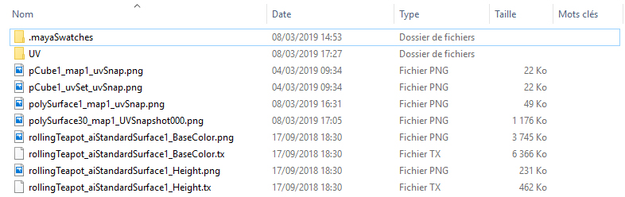  

8 - With UVSnaphots in it  

        
  

## Credits

Created by Tristan Le Granche  
Licence CC-BY-NC  

Bugs report and ask for commercial use to tristan.legranche@gmail.com